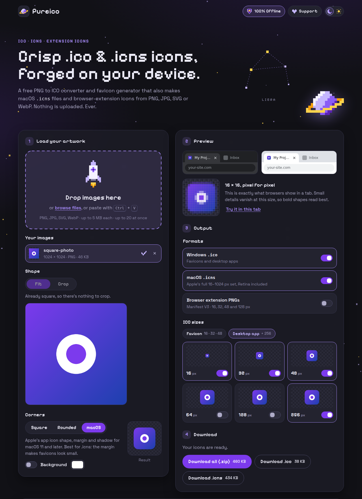

# Pureico

**Private ICO, ICNS and extension icon maker that runs entirely in your browser.**

[pureico.intercepth.dev](https://pureico.intercepth.dev)



Drop in a PNG, JPG, SVG or WebP and get a Windows `.ico`, a macOS `.icns` and a set of
browser-extension PNGs. Nothing is uploaded: there is no backend, and the page is not allowed to
send data anywhere.

## Features

- **Drag and drop, browse or paste** PNG, JPG, SVG and WebP files. Hovering files over the page
  shows whether they can be used.
- **Multi-size `.ico`** with toggles for 16, 32, 48, 64, 128 and 256 px, plus _Favicon_ and
  _Desktop app_ presets. Entries below 256 px are stored as 32-bit BMPs so old tools and Windows
  versions can read them; the 256 px entry is stored as PNG.
- **macOS `.icns`** with Apple's full 16–1024 px set, Retina sizes included, ready for Electron,
  PySide6, Tauri and other desktop apps.
- **Browser extension icons**: 16, 32, 48 and 128 px PNGs plus a copy-paste Manifest V3 `icons`
  snippet whose paths match the download.
- **Auto-squaring**: rectangular images are centered on a transparent square, or cropped with a
  draggable, keyboard-friendly crop box.
- **Corners and background tiles**: keep square corners, round them with an adjustable radius (up
  to a circle), or use Apple's macOS icon shape with its standard margin, continuous corners and a
  soft shadow. A background color with padding puts transparent logos on a solid tile. The mask
  is drawn at full resolution before scaling, so even 16 px icons get smooth edges.
- **Live preview** of the exact 16 × 16 bitmap in dark and light browser tabs, a pixel-level zoom,
  and a button to try the icon in Pureico's own tab.
- **Batch conversion** of up to 20 images into a single zip, one folder per image.
- **Background processing** in Web Workers with `OffscreenCanvas`, so the page stays responsive.
- **Helpful limits**: unsupported types, files over 5 MB, images over 8192 px per side and
  upscaling are explained inline.
- **Installable and offline**: a service worker caches the app, so it keeps working without a
  connection once it has loaded.
- **Recent conversions**: the last five downloads stay available until the tab is closed.
- **Dark and high-contrast light themes**, keyboard support and reduced-motion support.

## Privacy

- Images are decoded, resized and encoded in your browser. No server ever receives them.
- No analytics, cookies, third-party scripts, fonts or CDNs. Everything is served from this site.
- The Content Security Policy sets `connect-src 'none'` and `form-action 'none'`, so the page
  cannot upload anything, even if someone wanted it to. You can check this in your browser's
  developer tools.
- The end-to-end tests record every request made during a conversion and fail if any of them is
  not a plain `GET` to the site itself.

The full [privacy policy](https://pureico.intercepth.dev/privacy/) and
[terms of use](https://pureico.intercepth.dev/terms/) are published on the site.

## Security and accessibility

- Strict Content Security Policy, plus HSTS, `nosniff`, `frame-ancestors 'none'`, a locked-down
  Permissions Policy and `no-referrer` headers on Cloudflare Pages.
- Files are identified by their contents, size- and dimension-checked before decoding, and SVGs
  are only ever rendered as images, so their scripts can't run.
- Automated [axe-core](https://github.com/dequelabs/axe-core) checks run against WCAG 2.2 AA in
  both themes as part of the end-to-end tests.
- Dependabot keeps dependencies and GitHub Actions up to date.

Found a vulnerability? Please follow the [security policy](SECURITY.md).

## Development

Requires Node.js 22.12 or newer.

```sh
npm install
npm run dev        # local dev server
npm run check      # type checks, formatting and unit tests
npm run test:e2e   # builds the site and runs the Playwright tests
npm run build      # production build in dist/
```

The first `npm run test:e2e` may need `npx playwright install chromium`.

### Project layout

| Path                  | What lives there                                                        |
| --------------------- | ----------------------------------------------------------------------- |
| `src/core/`           | `.ico` and `.icns` encoders, file sniffing and other pure, tested logic |
| `src/worker/`         | The image-processing worker (decode, square, resample, encode, zip)     |
| `src/app/`, `src/ui/` | App state and the interface                                             |
| `src/art/`            | Pixel art, defined as editable text grids                               |
| `src/sw/`             | Service worker template                                                 |
| `privacy/`, `terms/`  | Privacy policy and terms of use pages                                   |
| `public/`             | Icons, manifest, `robots.txt`, `sitemap.xml`, `security.txt`, notices   |
| `build/plugins.ts`    | Build steps for the Content Security Policy, headers and offline cache  |
| `tests/unit/`         | Vitest unit tests                                                       |
| `tests/e2e/`          | Playwright end-to-end tests                                             |

## Deployment

The site is static and deploys to Cloudflare Pages:

1. In the Cloudflare dashboard, open **Workers & Pages → Create → Pages** and connect this
   repository.
2. Set the production branch to `main`, the build command to `npm run build` and the output
   directory to `dist`. The Node.js version is read from `.node-version`.
3. Under **Custom domains**, add `pureico.intercepth.dev`.

The build writes `dist/_headers`, which Cloudflare Pages uses for the security and caching headers.

## Browser support

Current versions of Chrome, Edge, Firefox and Safari (16.4 or newer). Pureico needs
`OffscreenCanvas` inside Web Workers.

## Support

Pureico is free, with no ads and no trackers. If it saved you time, you can
[support it on Ko-fi](https://ko-fi.com/intercepth).

## Contact

Questions or feedback: [contact@intercepth.dev](mailto:contact@intercepth.dev)

## License

[MIT](LICENSE) © 2026 Intercepth. Bundled fonts and libraries keep their own licenses; see
[`public/third-party-licenses.txt`](public/third-party-licenses.txt).
